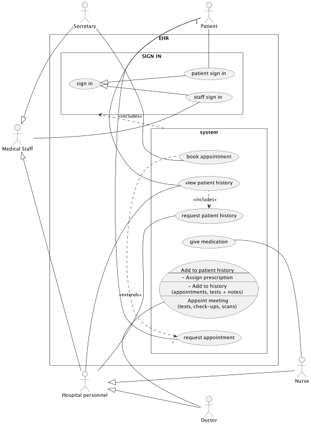

# electronic-health-record

An electronic health record (EHR) system, created by

    * Andreas
    * Eddie (Ed)
    * (Juan) Daniel
    * Kristófer
    * Logi

for the course **Software Development for Digital Health** in Block 3, Spring semester 2023 at Kobenhavns University.

### Diagrams

System Use Case diagram:

